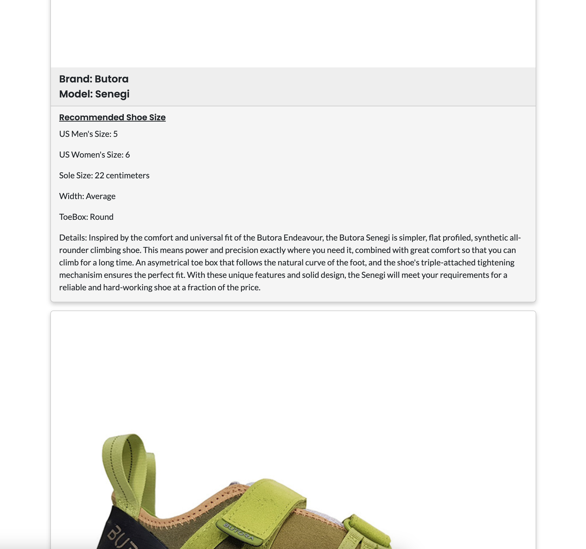

# <Shoe-Calculator-Rockfit>

## Description

This project is a rock climbing shoe calculator that will allow users to find a shoe that fits the length of their foot based of the length of the users foot length. It was originally build after speaking to a small business about lacking a sizing calculator for customers who may not have access to a store nearby to try the shoes but still wished to find a shoe that fits their size. I have sourced data for this project and hopefully can provide a solution to the issue of the customers wanting to find a show that fits them but also to possibly boost online shoe sales for this small business. 

## Installation

Required installations:
- Node
- MongooseDb
- Expressjs
- React

Upon cloning or downloading this repository and opening this code in a code editor, first make sure to npm install all the necessary dependancies in both the client and server folders. This is done by running npm run install in intergrated terminal and it will install all necessary dependancies in both the server and client folders. Once this is done go the server folder and run npm run seed to seed the shoe data into the mongoose database. Once done you can start both the front and back end by running npm run develop and the project should open up a browser page showcasing the project

## Usage

Live Link: https://rockfit-v2-c707e0324da7.herokuapp.com/

In order to use the project you can simply input the length of your foot in the search input and it should return shoe that has a matching sole size to you foot length, if not the error handling will inform the user that there are no shoes to match that size. There is also more information in the FAQ tab. 

## Credits

This project was built by me with help from Julie Pon for sourcing the raw shoe data. 

## License

MIT

---